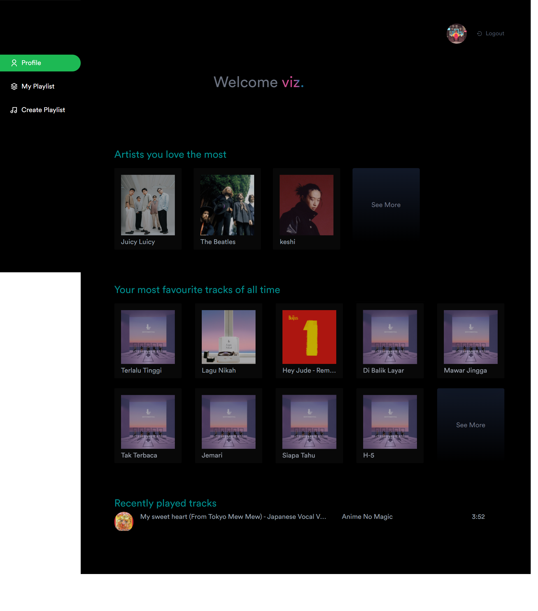
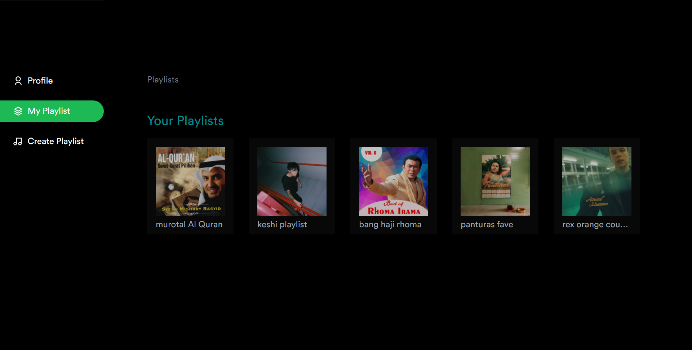
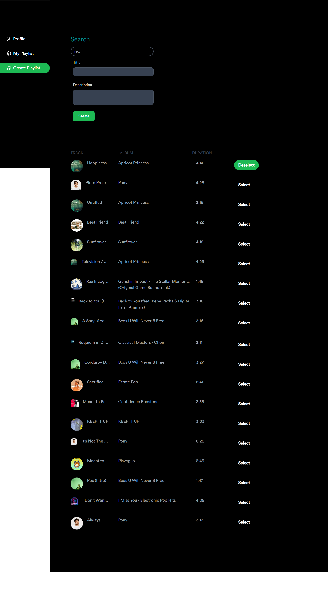

# 🎵 Spotiviz -A Spotify App by [haviz](https://www.linkedin.com/in/haviz-tasmara/)

Spotiviz is a  web app built using React, Tailwind, Axios, and Spotify API which provides personalised data using your Spotify account and Make a playlist. [visit the website](https://spotiviz.vercel.app)

## Features
- Using Implicit Grant Flow auth
- Search your favorite tracks from any genre
- Look at the song title, album name, artists, and durations
- Select or deselect track to add to the new playlist
- Write your playlist title (min 10 characters) and descriptions
- Create private playlist with your selected tracks, title and descriptions
- All playlists you make will be kept private.

## Additional Features
you can know
- your profile (name,photo,etc) 
- Logout Button
- Your most favourite artists of all time.
- Your most listened to tracks.
- Recently played tracks
- Your Playlist

# Screenshots
## Login Page

- 

## Profile Page

- 

## My Playlist Page

- 

## Create playlist Page

- 

To fill    ```bash
    REACT_APP_SPOTIFY_CLIENT_ID= 
    ``` you can follow tutorial from [Spotify Developer doc](https://developer.spotify.com/documentation/general/guides/authorization/app-settings/) to get your    ```bash
    CLIENT_ID
    ```.

## How to run on local

- Clone this project

    ```bash
    git clone https://github.com/haviz000/Spotiviz.git
    ```

- Go to the project folder

    ```bash
    cd Spotiviz
    ```

- Install dependencies

    ```bash
    npm install
    ```

- Setup environment variables

    Create file with name `.env.local` and add the following content:

    ```env
    REACT_APP_SPOTIFY_CLIENT_ID = <your spotify client id>
    ```

    To fill  ``` REACT_APP_SPOTIFY_CLIENT_ID ```  you can follow tutorial from [Spotify Developer doc](https://developer.spotify.com/documentation/general/guides/authorization/app-settings/) to get your `CLIENT_ID`

- Run the server

    ```bash
    npm start
    ```

- Open <http://localhost:3000> with your browser to see the result.

## Author

- [Mochamad Haviz Tasmara](https://www.linkedin.com/in/haviz-tasmara/)
